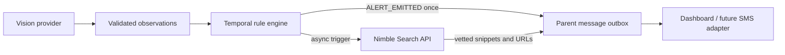

# Nimble Alert Research Architecture

Nightwatch uses Nimble after the monitoring engine has confirmed a concerning situation. The deterministic engine remains responsible for the alert decision; web research cannot create, delay, or suppress an alert.



When `ALERT_EMITTED` appears, `SessionRuntime` immediately creates an in-app parent notification. `NimbleSafetyResearchProvider` searches only `healthychildren.org` and `cpsc.gov`, requests up to three lightweight results, and attaches the returned summary and links to that notification. The query and provider are server-side, and the API key never reaches the browser.

If `NIMBLE_API_KEY` is absent, the same flow uses a labeled `demo_fallback` provider with preselected links. If a configured live lookup fails, the parent message still tells the parent to check the nursery and reports that research was unavailable.

## Local setup

```bash
cp .env.example .env
# Set NIMBLE_API_KEY in .env
npm run dev
```

At video time 26 seconds, the first `child_out_of_crib` situation crosses its threshold. The dashboard then shows the message in **Parent notifications**, including **NIMBLE LIVE** provenance and clickable sources. A second alert on the recurrence creates a second message; repeated observations do not duplicate either message.

## Extension point

The current delivery adapter is `in_app_demo`, which makes the complete flow visible without collecting personal contact details. A production transport can consume the same `ParentNotification` object and deliver it through SMS, push, or email. A useful next Nimble feature would be targeted CPSC recall lookup when the vision provider identifies a specific nursery product and model; that is more defensible than open-ended behavioral diagnosis.
